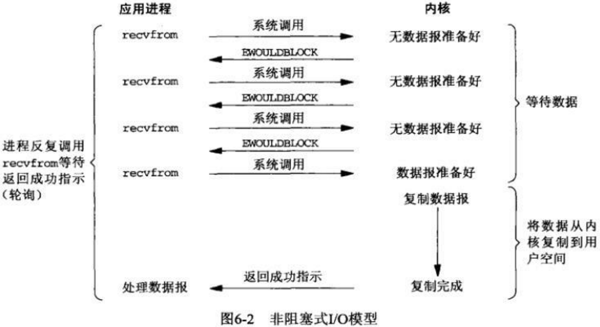

# Python高并发之asyncio
## 前言
这里先引用一下百度百科的定义.
> 并发，在操作系统中，是指一个时间段中有几个程序都处于已启动运行到运行完毕之间，且这几个程序都是在同一个处理机上运行，但任一个时刻点上只有一个程序在处理机上运行

里面的一个时间段内说明非常重要,这里假设这个时间段是一秒,所以本文指的并发是指服务器在一秒中处理的请求数量,即rps,那么rps高,本文就认为高并发.

啥?这不是你认为的高并发, 出门左转。

## 操作系统到底在干啥?
如果由笔者来概括，操作系统大概做了两件事情，计算与IO，任何具体数学计算或者逻辑判断，或者业务逻辑都是计算，而网络交互，磁盘交互，人机之间的交互都是IO。


## 高并发的瓶颈在哪?
根据笔者经验，**大多数**时候在IO上面。注意，这里说得是大多数，不是说绝对。

因为大多数时候业务本质上都是从数据库或者其他存储上读取内容，然后根据一定的逻辑，将数据返回给用户，比如**大多数**web内容。而大多数逻辑的交互都算不上计算量多大的逻辑，CPU的速度要远远高于内存IO,磁盘IO,网络IO, 而这些IO中网络IO最慢。

在根据上面的笔者对操作系统的概述，当并发高到一定的程度，根据业务的不同，比如计算密集，IO密集，或两者皆有，因此瓶颈可能出在计算上面或者IO上面，又或两者兼有。

而本文解决的高并发，是指IO密集的高并发瓶颈，因此，**计算密集的高并发**并不在本文的讨论范围内。

为了使本文歧义更少，这里的IO主要指**网络IO**.

## Python怎么处理高并发？
使用协程, 事件循环, 高效IO模型(比如多路复用，比如epoll), **三者缺一不可**。

很多时候，笔者看过的文章都是说协程如何如何，最后告诉我一些协程库或者asyncio用来说明协程的威力，最终我看懂了协程，却还是不知道它为啥能高并发，这也是笔者写本文的目的。

但是一切还是得从生成器说起，因为asyncio或者大多数协程库内部也是通过生成器实现的。

注意上面的**三者缺一不可**。
如果只懂其中一个，那么你懂了三分之一，以此类推，只有都会了，你才知道为啥协程能高并发。


## 生成器
生成器的定义很抽象，现在不懂没关系，但是当你懂了之后回过头再看，会觉得定义的没错，并且准确。下面是定义
> 摘自百度百科: 生成器是一次生成一个值的特殊类型函数。可以将其视为可恢复函数。

关于生成器的内容，本文着重于生成器实现了哪些功能，而不是生成器的原理及内部实现。

### yield
简单例子如下

```
def gen_func():
    yield 1
    yield 2
    yield 3

if __name__ == '__main__':
    gen = gen_func()
    for i in gen:
        print(i)

output:
1
2
3
```
上面的例子没有什么稀奇的不是吗？yield像一个特殊的关键字，将函数变成了一个类似于迭代器的对象，可以使用for循环取值。


### send, next
协程自然不会这么简单，python协程的目标是星辰大海，从上面的例之所以get不到它的野心，是因为你没有试过send, next两个函数。

首先说next

```
def gen_func():
    yield 1
    yield 2
    yield 3

if __name__ == '__main__':
    gen = gen_func()
    print(next(gen))
    print(next(gen))
    print(next(gen))

output:
1
2
3

```
next的操作有点像for循环，每调用一次next，就会从中取出一个yield出来的值，其实还是没啥特别的，感觉还没有for循环好用。

不过，不知道你有没有想过，如果你只需要一个值，你next一次就可以了，然后你可以去做其他事情，等到需要的时候才回来再次next取值。

就这一部分而言，你也许知道为啥说生成器是可以**暂停**的了，不过，这似乎也没什么用，那是因为你不知到时，生成器除了可以抛出值，还能将值传递进去。

接下来我们看send的例子。

```
def gen_func():
    a = yield 1
    print("a: ", a)
    b = yield 2
    print("b: ", b)
    c = yield 3
    print("c: ", c)
    return "finish"

if __name__ == '__main__':
    gen = gen_func()
    for i in range(4):
        if i == 0:
            print(gen.send(None))
        else:
            # 因为gen生成器里面只有三个yield，那么只能循环三次。
            # 第四次循环的时候,生成器会抛出StopIteration异常,并且return语句里面内容放在StopIteration异常里面
            try:
                print(gen.send(i))
            except StopIteration as e:
                print("e: ", e)

output:
1
a:  1
2
b:  2
3
c:  3
e:  finish
```
send有着next差不多的功能，不过send在传递一个值给生成器的同时，还能获取到生成器yield抛出的值，在上面的代码中，send分别将None,1,2,3四个值传递给了生成器，之所以第一需要传递None给生成器，是因为规定，之所以规定，因为第一次传递过去的值没有特定的变量或者说对象能接收，所以规定只能传递None, 如果你传递一个非None的值进去，会抛出一下错误

```
TypeError: can't send non-None value to a just-started generator
```

从上面的例子我们也发现，生成器里面的变量a,b,c获得了，send函数发送将来的1, 2, 3.

> 如果你有事件循环或者说多路复用的经验，你也许能够隐隐察觉到微妙的感觉。
> 
> 这个微妙的感觉是，是否可以将IO操作yield出来？由事件循环调度, 如果你能get到这个微妙的感觉,那么你已经知道协程高并发的秘密了.
> 

但是还差一点点.嗯, 还差一点点了.

### yield from
下面是yield from的例子

```
def gen_func():
    a = yield 1
    print("a: ", a)
    b = yield 2
    print("b: ", b)
    c = yield 3
    print("c: ", c)
    return 4


def middle():
    gen = gen_func()
    ret = yield from gen
    print("ret: ", ret)
    return "middle Exception"


def main():
    mid = middle()
    for i in range(4):
        if i == 0:
            print(mid.send(None))
        else:
            try:
                print(mid.send(i))
            except StopIteration as e:
                print("e: ", e)


if __name__ == '__main__':
    main()


output: 
1
a:  1
2
b:  2
3
c:  3
ret:  4
e:  middle Exception
```
从上面的代码我们发现,main函数调用的middle函数的send,但是gen_func函数却能接收到main函数传递的值.有一种透传的感觉,这就是yield from的作用, 这很**关键**。

而yield from最终传递出来的值是StopIteration异常，异常里面的内容是最终接收生成器(本示例是gen_func)return出来的值，所以ret获得了gen_func函数return的4.但是ret将异常里面的值取出之后会继续将接收到的异常往上抛，所以main函数里面需要使用try语句捕获异常。而gen_func抛出的异常里面的值已经被middle函数接收，所以middle函数会将抛出的异常里面的值设为自身return的值，

至此生成器的全部内容讲解完毕，如果，你get到了这些功能，那么你已经会使用生成器了。


### 小结
再次强调,本小结只是说明生成器的功能,至于具体生成器内部怎么实现的,你可以去看其他文章,或者阅读源代码.

## io模型
Linux平台一共有五大IO模型，每个模型有自己的优点与确定。根据应用场景的不同可以使用不同的IO模型。

不过本文主要的考虑场景是高并发，所以会**针对高并发的场景做出评价**。


### 同步IO


同步模型自然是效率最低的模型了，每次只能处理完一个连接才能处理下一个,如果**只有一个线程的话**, 如果有一个连接一直占用，那么后来者只能傻傻的等了。所以不适合高并发，不过最简单，符合惯性思维。


### 非阻塞式IO


不会阻塞后面的代码，但是需要不停的显式询问内核数据是否准备好，一般通过while循环，而while循环会耗费大量的CPU。所以也不适合高并发。


### 多路复用


当前最流行，使用最广泛的高并发方案。

而多路复用又有三种实现方式, 分别是select, poll, epoll。

#### select, poll, epoll
select,poll由于设计的问题，当处理连接过多会造成性能线性下降，而epoll是在前人的经验上做过改进的解决方案。不会有此问题。

不过select, poll并不是一无是处，假设场景是连接数不多，并且每个连接非常活跃，select，poll是要性能高于epoll的。

至于为啥，查看小结参考链接, 或者自行查询资料。

但是本文讲解的高并发可是指的连接数非常多的。
### 信号驱动式IO


很偏门的一个IO模型，不曾遇见过使用案例。看模型也不见得比多路复用好用。

### 异步非阻塞IO


用得不是很多，理论上比多路复用更快，因为少了一次调用，但是实际使用并没有比多路复用快非常多，所以为啥不使用广泛使用的多路复用。

### 小结
使用最广泛多路复用epoll, 可以使得IO操作更有效率。但是使用上有一定的难度。

至此，如果你理解了多路复用的IO模型，那么你了解python为什么能够通过协程实现高并发的三分之二了。


IO模型参考: https://www.jianshu.com/p/486b0965c296
select,poll,epoll区别参考: https://www.cnblogs.com/Anker/p/3265058.html

## 事件循环
上面的IO模型能够解决IO的效率问题，但是实际使用起来需要一个事件循环驱动协程去处理IO。

### 简单实现
下面引用官方的一个简单例子。

```
import selectors
import socket

# 创建一个selctor对象
# 在不同的平台会使用不同的IO模型,比如Linux使用epoll, windows使用select(不确定)
# 使用select调度IO
sel = selectors.DefaultSelector()


# 回调函数,用于接收新连接
def accept(sock, mask):
    conn, addr = sock.accept()  # Should be ready
    print('accepted', conn, 'from', addr)
    conn.setblocking(False)
    sel.register(conn, selectors.EVENT_READ, read)


# 回调函数,用户读取client用户数据
def read(conn, mask):
    data = conn.recv(1000)  # Should be ready
    if data:
        print('echoing', repr(data), 'to', conn)
        conn.send(data)  # Hope it won't block
    else:
        print('closing', conn)
        sel.unregister(conn)
        conn.close()


# 创建一个非堵塞的socket
sock = socket.socket()
sock.bind(('localhost', 1234))
sock.listen(100)
sock.setblocking(False)
sel.register(sock, selectors.EVENT_READ, accept)


# 一个事件循环,用于IO调度
# 当IO可读或者可写的时候, 执行事件所对应的回调函数
def loop():
    while True:
        events = sel.select()
        for key, mask in events:
            callback = key.data
            callback(key.fileobj, mask)


if __name__ == '__main__':
    loop()

```
上面代码中loop函数对应事件循环,它要做的就是一遍一遍的等待IO,然后调用事件的回调函数.

但是作为事件循环远远不够,比如怎么停止,怎么在事件循环中加入其他逻辑.


### 小结
如果就功能而言,上面的代码似乎已经完成了高并发的影子,但是如你所见,直接使用select的编码难度比较大, 再者回调函数素来有"**回调地狱**"的恶名.

实际生活中的问题要复杂的多，作为一个调库狂魔，怎么可能会自己去实现这些，所以python官方实现了一个跨平台的事件循环，至于IO模型具体选择，官方会做适配处理。

不过官方实现是在Python3.5及以后了，3.5之前的版本只能使用第三方实现的高并发异步IO解决方案, 比如tornado,gevent,twisted。

至此你需要get到python高并发的必要条件了.

## asyncio
在本文开头,笔者就说过,python要完成高并发需要协程,事件循环,高效IO模型.而Python自带的asyncio模块已经全部完成了.尽情使用吧.

下面是有引用官方的一个例子

```
import asyncio


# 通过async声明一个协程
async def handle_echo(reader, writer):
    # 将需要io的函数使用await等待, 那么此函数就会停止
    # 当IO操作完成会唤醒这个协程
    # 可以将await理解为yield from
    data = await reader.read(100)
    message = data.decode()
    addr = writer.get_extra_info('peername')
    print("Received %r from %r" % (message, addr))

    print("Send: %r" % message)
    writer.write(data)
    await writer.drain()

    print("Close the client socket")
    writer.close()


# 创建事件循环
loop = asyncio.get_event_loop()
# 通过asyncio.start_server方法创建一个协程
coro = asyncio.start_server(handle_echo, '127.0.0.1', 8888, loop=loop)
server = loop.run_until_complete(coro)

# Serve requests until Ctrl+C is pressed
print('Serving on {}'.format(server.sockets[0].getsockname()))
try:
    loop.run_forever()
except KeyboardInterrupt:
    pass

# Close the server
server.close()
loop.run_until_complete(server.wait_closed())
loop.close()
```

总的来说python3.5明确了什么是协程，什么是生成器，虽然原理差不多，但是这样会使得不会让生成器即可以作为生成器使用(比如迭代数据)又可以作为协程。

所以引入了async,await使得协程的语义更加明确。


## asyncio生态
asyncio官方只实现了比较底层的协议，比如TCP，UDP。所以诸如HTTP协议之类都需要借助第三方库，比如aiohttp。

虽然异步编程的生态不够同步编程的生态那么强大，但是如果又高并发的需求不妨试试，下面说一下比较成熟的异步库

### aiohttp
异步http client/server框架

github地址: https://github.com/aio-libs/aiohttp

### sanic
速度更快的类flask web框架。

github地址:
https://github.com/channelcat/sanic

### uvloop
快速，内嵌于asyncio事件循环的库，使用cython基于libuv实现。

官方性能测试:
nodejs的两倍，追平golang

github地址: https://github.com/MagicStack/uvloop

> 为了减少歧义，这里的性能测试应该只是网络IO高并发方面不是说任何方面追平golang。


## 总结
Python之所以能够处理网络IO高并发，是因为借助了高效的IO模型，能够最大限度的调度IO，然后事件循环使用协程处理IO，协程遇到IO操作就将控制权抛出，那么在IO准备好之前的这段事件，事件循环就可以使用其他的协程处理其他事情，然后协程在用户空间，并且是单线程的，所以不会像多线程，多进程那样频繁的上下文切换，因而能够节省大量的不必要性能损失。

> 注: 不要再协程里面使用time.sleep之类的同步操作，因为协程再单线程里面，所以会使得整个线程停下来等待，也就没有协程的优势了


本文主要讲解Python为什么能够处理高并发,不是为了讲解某个库怎么使用,所以使用细节请查阅官方文档或者执行。

无论什么编程语言，高性能框架，一般由事件循环 + 高性能IO模型(也许是epoll)


