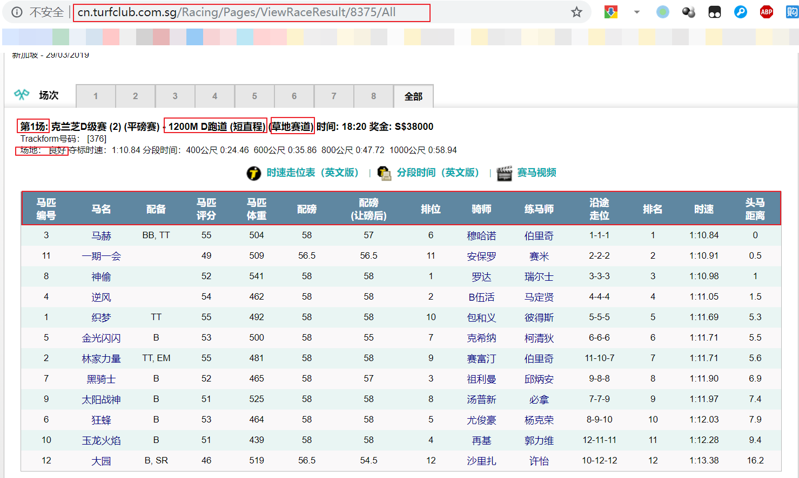
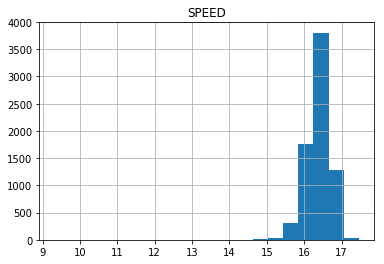
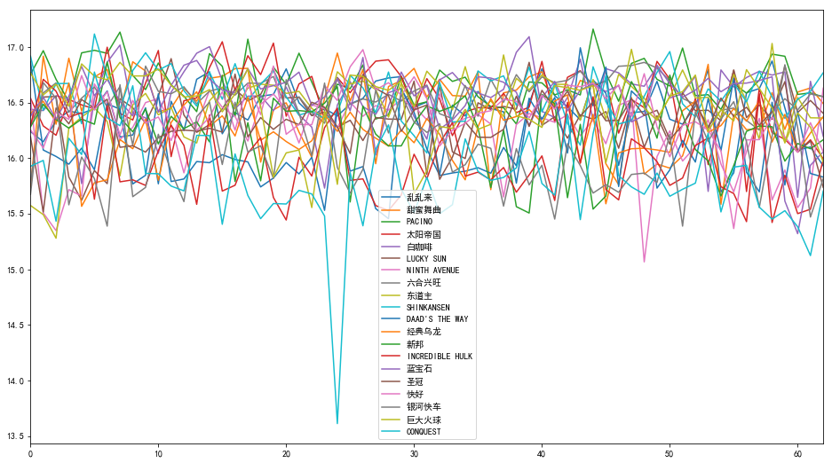
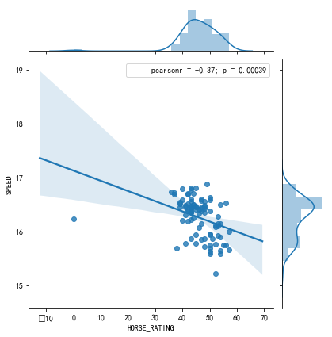

## 前言
香港影视剧里面比较有意思的元素是赛马, 忽然弄懂了一部分赛马的投注规则，再者学些机器学习ing，所以试试能否通过机器学习来预测赛马结果。

> 注: 这里当然任何没有鼓励大家赌博的意思，纯粹练手。

> 为了避免直接被用于线下实战中，所以这里使用的是**新加坡**的数据.

源代码: [机器学习与horse](https://github.com/youerning/blog/tree/master/ml_and_horse_race)


## 文章结构
- 数据获取
- 数据分析
- 数据可视化
- 机器学习
- 总结

## 数据获取
由于新加坡的网站不能直接访问需要梯子，由于没有比较好的梯子，所以采用单线程访问，怕被屏蔽IP，有兴趣的可以在有比较好的墙外代理的话，可以加上多线程或者多协程. 而scrapy之类的框架用的不多，所以手写了。

虽然很简单，但是代码也有300多行，这里只讲逻辑，源代码可以直接查看源代码。

### 找出链接
经过**观察**，官网的每日的结果在209/01/01之后会有一个递增的ID值，2009/01/01的ID值是1，下一日是2，以此类推，截止至2019/03/29日，ID值为8375.

而历史结果通过下面的形式访问:
```
http://cn.turfclub.com.sg/Racing/Pages/ViewRaceResult/<ID>/All

如:
http://cn.turfclub.com.sg/Racing/Pages/ViewRaceResult/1/All
```
因此遍历所有ID范围就能获取所有历史结果。
代码示例如下:
```
base_url = "http://cn.turfclub.com.sg/Racing/Pages/ViewRaceResult/%s/All"
for num in range(start_num, 8376):
    url = base_url % num
    soup = download(url)
        
```

### 找出数据
经过**观察**，主观觉得需要以下字段。




### 存储数据
为了减少对数据库的依赖这里通过sqlite3存储数据.
关于sqlite3的数据格式存储结果及csv的结果可以在源代码仓库查看。

Sqlite3数据结构如下:

```
CREATE TABLE IF NOT EXISTS DATA
   (ID CHAR(30) PRIMARY KEY     NOT NULL,
   DATE         CHAR(20)    NOT NULL,
   LOCATION     CHAR(30) NOT NULL,
   LENGTH       INT     NOT NULL,
   TRACK        CHAR(30) NOT NULL,
   TRACK_TYPE   CHAR(30),
   TRACK_STATUS CHAR(30)     NOT NULL,
   RACE_NUM     INT     NOT NULL,
   H_NO         INT     NOT NULL,
   HORSE_NAME   CHAR(30)     NOT NULL,
   GEAR         CHAR(30),
   HORSE_RATING INT     NOT NULL,
   H_WT         REAL     NOT NULL,
   HCP_WT       REAL     NOT NULL,
   C_WT         REAL     NOT NULL,
   BAR          INT     NOT NULL,
   JOCKEY       CHAR(30)     NOT NULL,
   TRAINER      CHAR(30)     NOT NULL,
   RUNING_POSITION   CHAR(10)     NOT NULL,
   PI           INT     NOT NULL,
   TOTAL_SECONDS     INT,
   LBW          REAL     NOT NULL
   );
```


### 小结
很有意思的是，在这些结果里面除了新加坡的结果还有其他国家的结果，我也不知道为啥，这里这里只取新加坡的数据结果。

还有就是有的ID值没有结果，我也不知道为啥。


> 注: 在获取过程中，有些部分处理的并不是非常好，所以一些字符串类型的数据，摘取的并不是非常准确, 所以GitHub仓库里面提供的数据文件，有一小部分会有问题，希望你知悉。

## 数据分析
上一节我们将数据爬了下来，这一节就是将数据进行一些统计分析，试图发现一些其中的规律。

### 准备工作
首先导入python数据分析三剑客

```
import pandas as pd
import numpy as np
import matplotlib.pyplot as plt
```

将保存的数据通过pandas加载。

```
import sqlite3
conn = sqlite3.connect('data.db')
df = pd.read_sql("SELECT * FROM DATA", conn, index_col="ID", parse_dates=["DATE"])
```

### 常规操作
查看数据
df.head()
```
DATE	LOCATION	LENGTH	TRACK	TRACK_TYPE	TRACK_STATUS	RACE_NUM	H_NO	HORSE_NAME	GEAR	...	H_WT	HCP_WT	C_WT	BAR	JOCKEY	TRAINER	RUNING_POSITION	PI	TOTAL_SECONDS	LBW
ID																					
2009-01-01-1-3-1	2009-01-01	新加坡	1700	unkonw	(POLYTRACK)	良好	1	10	WINNIEDUN		...	440.0	52.0	52.0	3	M AU	HK TAN	1-1-1	1	0.0	0.0
2009-01-01-1-9-2	2009-01-01	新加坡	1700	unkonw	(POLYTRACK)	良好	1	2	REGAL KNIGHT		...	457.0	59.0	57.0	9	E ASLAM	L TRELOAR	9-5-2	2	0.0	0.5
2009-01-01-1-10-3	2009-01-01	新加坡	1700	unkonw	(POLYTRACK)	良好	1	3	JOYLUCK		...	477.0	58.5	58.5	10	N CALLOW	RB MARSH	11-10-3	3	0.0	1.3
2009-01-01-1-1-4	2009-01-01	新加坡	1700	unkonw	(POLYTRACK)	良好	1	1	MAJESTIC KNIGHT		...	521.0	59.0	55.0	1	T. AFFANDI	L TRELOAR	4-3-4	4	0.0	1.8
2009-01-01-1-8-5	2009-01-01	新加坡	1700	unkonw	(POLYTRACK)	良好	1	7	ELEVENTH AVENUE		...	477.0	54.5	54.5	8	R FRADD	M FREEDMAN	8-8-5	5	0.0	2.6
```

常规统计
df.descibe()
```

LENGTH	RACE_NUM	H_NO	HORSE_RATING	H_WT	HCP_WT	C_WT	BAR	PI	TOTAL_SECONDS	LBW
count	88110.000000	88110.000000	88110.000000	88110.000000	88110.000000	88110.000000	88110.000000	88110.000000	88110.000000	88110.000000	88110.000000
mean	1331.634321	5.464317	6.324413	47.422812	495.280524	54.975701	54.326813	6.137975	6.339610	79.863567	5.974457
std	256.724820	2.977882	3.494310	20.767828	31.383475	2.532528	2.667349	3.383717	5.787673	20.725862	5.966324
min	1000.000000	1.000000	1.000000	0.000000	372.000000	45.500000	0.000000	0.000000	1.000000	0.000000	0.000000
25%	1200.000000	3.000000	3.000000	40.000000	474.000000	53.000000	52.500000	3.000000	3.000000	70.052500	2.100000
50%	1200.000000	5.000000	6.000000	49.000000	494.000000	55.500000	55.000000	6.000000	6.000000	73.650000	4.900000
75%	1600.000000	8.000000	9.000000	59.000000	516.000000	57.000000	56.500000	9.000000	9.000000	94.980000	8.200000
max	2400.000000	12.000000	18.000000	127.000000	647.000000	59.500000	59.500000	16.000000	99.000000	640.980000	99.800000
```

### 有的放矢
查看自己感兴趣的数据

#### 查看每匹马每场比赛的速度
首先去掉total_seconds为零的场次

其实我应该讲时间字段的原始数据保存下来的，这里原始数据其实是0:00.00, 

但是由于为了怕时间单位一样，但是名次不一样，所以在时间单位上还加了一个离头马的距离除以100，假设离头马的距离是1，那么1/100 等于10毫秒

所以这里应该去掉小于1的数据, 但是数据其实还是有些异常，所以去掉小于50的结果
```

df2 = df.query("TOTAL_SECONDS > 50")
df2["SPEED"] = df["LENGTH"] / df["TOTAL_SECONDS"]
df2["SPEED"].head()

ID
2009-04-03-1-8-1     16.605385
2009-04-03-1-5-2     16.568047
2009-04-03-1-7-3     16.560208
2009-04-03-1-10-4    16.554334
2009-04-03-1-3-5     16.495817
Name: SPEED, dtype: float64
```


#### 查看每个骑师每场比赛的速度

```
df2[["SPEED", "JOCKEY"]].groupby("JOCKEY").mean().sort_values(by="SPEED").tail()


            SPEED
JOCKEY	
麦维凯	16.899374
郗福年	16.952015
薛凯华	16.969355
杜美尔	16.973066
杜利莱	17.204301

df2[["SPEED", "JOCKEY"]].groupby("JOCKEY").mean().mean()
SPEED    16.400328
dtype: float64
```


## 数据可视化
可视化自己感兴趣的特征值

可视化速度分布

```
df2[["SPEED", "HORSE_NAME"]].groupby("HORSE_NAME").mean().hist(bins=20)
```


可视化马匹速度的历史规律

```
# 首先找一匹历史数据中比赛次数最多的马匹

speed_and_horse = df2[["SPEED", "HORSE_NAME"]]
pd.value_counts(speed_and_horse["HORSE_NAME"]).head()

乱乱来       89
甜蜜舞曲      77
PACINO    71
太阳帝国      69
白咖啡       68
Name: HORSE_NAME, dtype: int64

speed_and_horse.query('HORSE_NAME == "乱乱来"').plot(figsize=(16,9))
```


可以发现这匹马在18年以前基本上还是在16.25左右上下徘徊, 不好不坏， 但是18年以后就不行了，可能老了吧

但是很有可能这是特例，所以我们将出场次数前20的马匹都绘制出来


顺便绘制一下比赛次数的前二十匹马的历史数据。

```
#  首先看看前二十的马匹
pd.value_counts(speed_and_horse["HORSE_NAME"]).head(20)

乱乱来                89
甜蜜舞曲               77
PACINO             71
太阳帝国               69
白咖啡                68
LUCKY SUN          67
NINTH AVENUE       66
六合兴旺               66
东道主                66
SHINKANSEN         65
DAAD'S THE WAY     65
经典乌龙               64
新邦                 64
INCREDIBLE HULK    64
蓝宝石                64
圣冠                 64
快好                 64
银河快车               64
巨大火球               64
CONQUEST           63
Name: HORSE_NAME, dtype: int64


plot_df = pd.DataFrame()
plt.rcParams['font.sans-serif'] = ['simhei']
for horse_name in pd.value_counts(speed_and_horse["HORSE_NAME"]).head(20).index:
    df_horse = speed_and_horse.query(f'HORSE_NAME == "{horse_name}"')["SPEED"].iloc[:63]

    plot_df[horse_name] = df_horse.reset_index()["SPEED"]


plot_df.plot(figsize=(16,9))
```



## 机器学习
不知大家是否知道的赛马的规则，比赛的名次排名是谁的速度最快，谁就获胜，所以想要预测比赛的名次应该是比较谁的速度快，而不是看其获得名次的概率，换言之，这是一个回归的问题。

这里就尝试线性回归吧。
> 为啥不用神经网络深度学习什么的？不会呀

### 特征选择
首先选择特征跟预测值，预测值很好确定，就是前面的速度。

首先靠直觉选几个特征可视化以下。这里选择的特征是C_WT(配磅)，以及HORSE_RATING(马匹评分)。

> 配磅是指，让马匹配备以下重量的物件，用于尽可能让本轮比赛的每匹马的状态差不多，锄强扶弱。

> 马匹评分由马会根据制定的规则打分。

可视化一下C_WT与SPEED之间的关系

```
# 这里还是选择查看  "乱乱来"这匹马

df2.query('HORSE_NAME == "乱乱来"')[["C_WT", "SPEED"]].reset_index().plot.scatter(x="C_WT", y="SPEED", figsize=(16,9))

```


上图看不出啥，但是大概知道两者没啥相关性，可借用seaborn更直观的可视化一下


```
import seaborn as sns
j = sns.jointplot("C_WT", "SPEED", data=df2.query('HORSE_NAME == "乱乱来"')[["C_WT", "SPEED"]].reset_index(), kind="reg")
# j = sns.jointplot('Num of A', ' Ratio B', data = data_df, kind='reg', height=8)
j.annotate(stats.pearsonr)
```


可视化一下HORS_RATING与SPEED之间的关系

```
import seaborn as sns
import scipy.stats as stats

j = sns.jointplot("HORSE_RATING", "SPEED", data=df2.query('HORSE_NAME == "乱乱来"')[["HORSE_RATING", "SPEED"]].reset_index(), kind="reg")
j.annotate(stats.pearsonr)
```


很明显还是没啥关系。

其实相关性太差，但是不适合做特征，但是又不是真的为了真的做一个可以实战的模型，这里就将这两个做作为特征吧。

> 为了机器学习而学习吧， 强行拟合！！！

### 拟合模型
选一个模型，这里选择LinearRegression。

```
from sklearn.linear_model import LinearRegression
df_lll = df2.query("HORSE_NAME == '乱乱来'")[["SPEED", "C_WT", "HORSE_RATING"]]
split_index = int(len(df_lll) * 0.6)
X_Train = df_lll[:split_index][["C_WT", "HORSE_RATING"]]
Y_Train = df_lll[:split_index][["SPEED"]]
X_Test = df_lll[split_index:][["C_WT", "HORSE_RATING"]]
Y_Test = df_lll[split_index:][["SPEED"]]

model = LinearRegression()
model.fit(X_Train.values, Y_Train.values)
```

将结果拟合的模型可视化一下

```
from mpl_toolkits.mplot3d import Axes3D
fig = plt.figure()
ax = Axes3D(fig)
ax.set_xlabel("C_WT")
ax.set_xlabel("HORSE_RATING")
ax.set_xlabel("SPEED")
ax.scatter(X_Train["C_WT"].values, X_Train["HORSE_RATING"].values, Y_Train.values)
ax.plot_surface(X_Train["C_WT"].values, X_Train["HORSE_RATING"].values, model.predict(X_Train.values))
```


## 总结
其实在机器学习这一节应该将数据正则一下，或者说清洗一下。但是没关系，本来就知道没啥好拟合的。

关于本文的notebook也在源代码里面。有空在写。


## 后记
其实这里不应该基于特征做模型，因为赛果的成绩精度非常高，再者会有很多噪音会干扰的结果，所以无论回归还是分类的结果都不能精确的命中最终结果(不过也有可能是我的水平有限)。

既然不行为啥还写篇文章？论证一下咯。

但是就个人而言，我觉得还是可以提升一定的命中概率的，没必要那么精确，那么提升概率的关键在于均值回归，即每匹马的速度回围绕着一个均值来回震动，如果大家有兴趣，我们来做一个更细致的分析吧。

